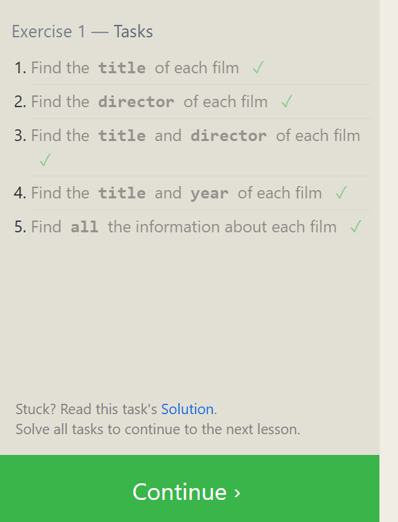
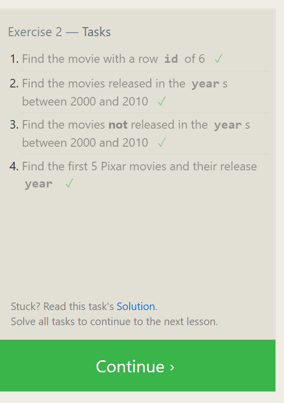
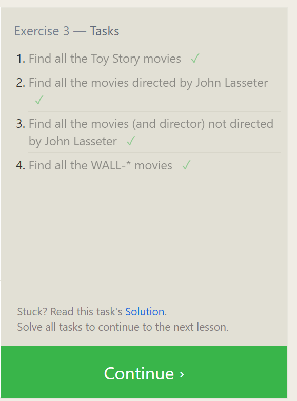
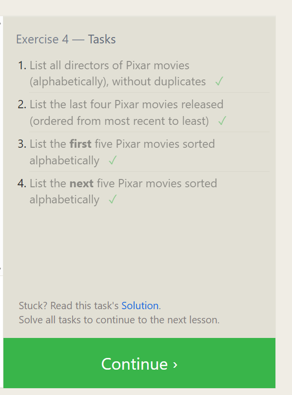

## Exercise 1 — Tasks
  1. Find the title of each film ✓
  2. Find the director of each film ✓
  3. Find the title and director of each film ✓
  4. Find the title and year of each film ✓
  5. Find all the information about each film ✓

  

  ## Exercise 2 — Tasks
1. Find the movie with a row id of 6 ✓
2. Find the movies released in the years between    2000 and 2010 ✓
3. Find the movies not released in the years between 2000 and 2010 ✓
4. Find the first 5 Pixar movies and their release year ✓

## Exercise 3 — Tasks
1. Find all the Toy Story movies ✓
2. Find all the movies directed by John Lasseter ✓
3. Find all the movies (and director) not directed by John Lasseter ✓
4. Find all the WALL-* movies ✓

## Exercise 4 — Tasks
1. List all directors of Pixar movies (alphabetically), without duplicates ✓
2. List the last four Pixar movies released (ordered from most recent to least) ✓
3. List the first five Pixar movies sorted alphabetically ✓
4. List the next five Pixar movies sorted alphabetically ✓

