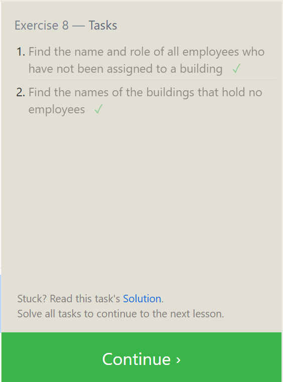
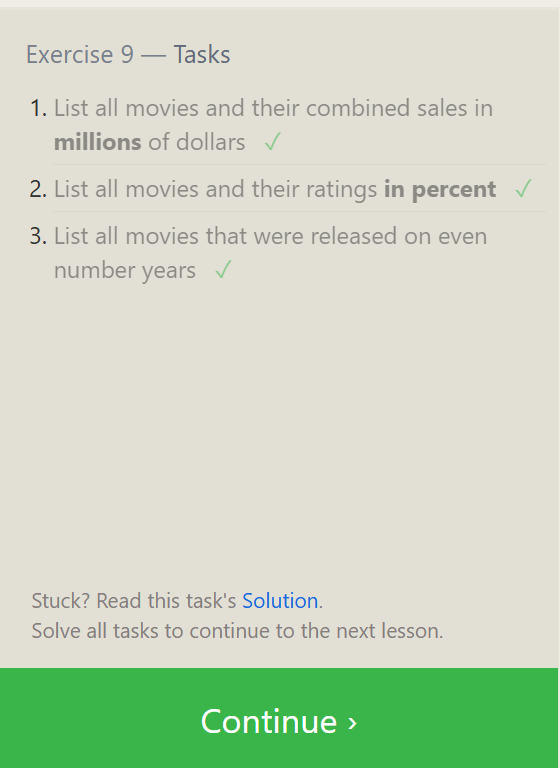
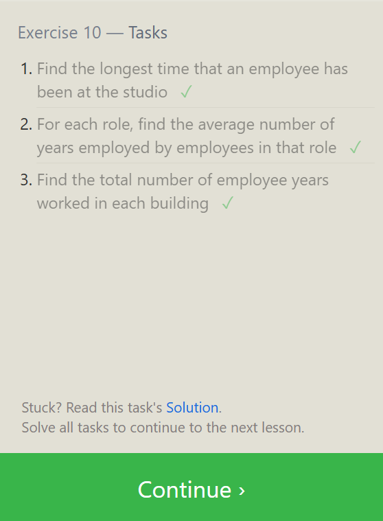
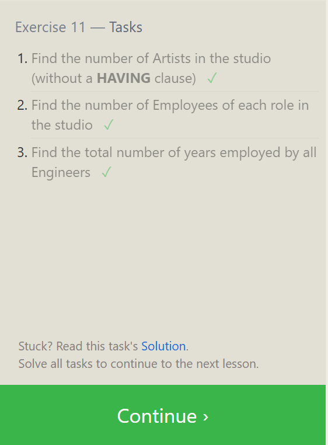

## notes
```
1. Normalisation  because  avoid anamaly 
2. why do this because safety
3. primary keys - 1. unique 2. null 3.
4. repeating groups are not allow 
########################################
```

exercise-06.
1
```
 SELECT * 
FROM movies
inner join boxoffice on
Movies.id =Boxoffice.Movie_id;
```
2
```
SELECT * 
FROM movies
inner join boxoffice on
Movies.id =Boxoffice.Movie_id
where domestic_sales<international_sales;
```
3
```
SELECT * 
FROM movies
inner join boxoffice on
Movies.id =Boxoffice.Movie_id
order by Rating desc;
```


exercise-07

1.
```
SELECT building from employees

;
```

2.
```
SELECT *from buildings

;
```

3
```
SELECT Distinct Building_name,Role 
FROM buildings  
left join employees 
on building_name=employees.building;
```


## Exercise 8
1
```
SELECT Role,Name,building
FROM Employees
WHERE Building is Null;

```

2

```
SELECT DISTINCT building_name
FROM buildings 
LEFT JOIN employees
ON building_name = building
WHERE role IS NULL;
```


## Exercise 9
1
```
SELECT title ,(domestic_sales + international_sales)/1000000 
FROM movies
left JOIN  boxoffice
on movies.id = boxoffice.movie_id;
```

2
```
SELECT title , rating*10
FROM movies
join boxoffice
on movies.id =boxoffice.movie_id;
```

3.
```
SELECT title ,year
FROM movies
where year%2=0;
```



## Exercise 10

1.
```
SELECT Max(years_employed)
FROM employees
;
```
2.
```
SELECT role,AVG(years_employed)
FROM employees
GROUP BY role
;
```

3

```
SELECT building,sum(years_employed)
FROM employees
group by building;
```



## Exercise 11
1
```
SELECT sum (role="Artist") 
FROM employees
;
```
2
```
SELECT role,count(role="role")
FROM employees
group by role;
```
3
```
SELECT * ,sum(years_employed)
FROM employees
where  role="Engineer" ;

```



## Exercise 12

1.
```
SELECT title,director,count(director )
FROM movies
group by director ;
```