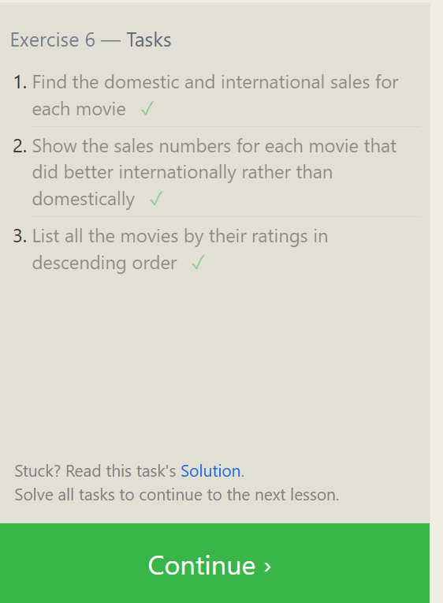
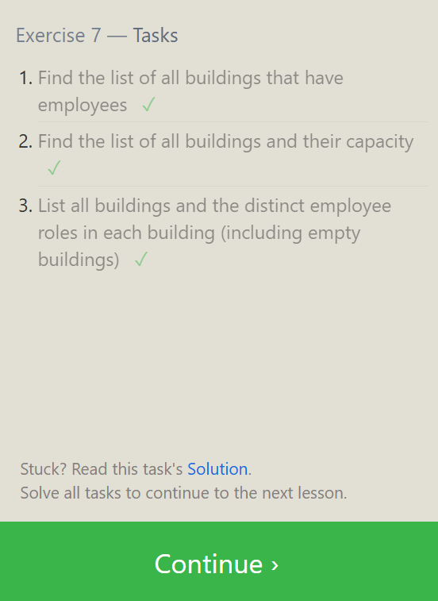

## notes
```
1. Normalisation  because  avoid anamaly 
2. why do this because safety
3. primary keys - 1. unique 2. null 3.
4. repeating groups are not allow 
########################################
```

exercise-06.
1
```
 SELECT * 
FROM movies
inner join boxoffice on
Movies.id =Boxoffice.Movie_id;
```
2
```
SELECT * 
FROM movies
inner join boxoffice on
Movies.id =Boxoffice.Movie_id
where domestic_sales<international_sales;
```
3
```
SELECT * 
FROM movies
inner join boxoffice on
Movies.id =Boxoffice.Movie_id
order by Rating desc;
```



exercise-07

1.
```
SELECT building from employees

;
```

2.
```
SELECT *from buildings

;
```

3
```
SELECT Distinct Building_name,Role 
FROM buildings  
left join employees 
on building_name=employees.building;
```




## Exercise 8
1
```
SELECT Role,Name,building
FROM Employees
WHERE Building is Null;
```